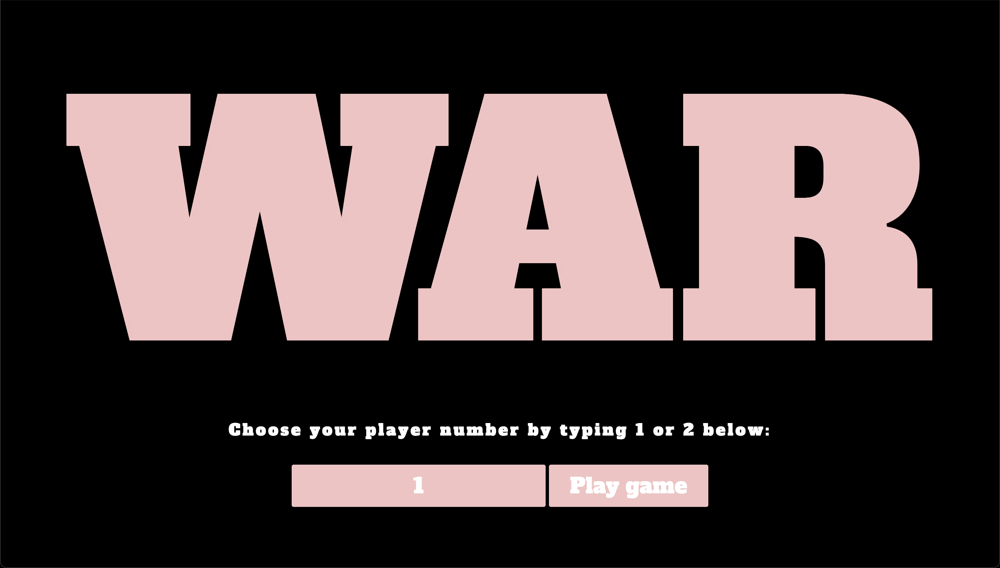

# Full-Stack War Card Game Simulator with Express
This is an updated version of my original war simulator but this time using the Express framework instead of vanilla Node. 

**Link to project:** https://war-ii.onrender.com/

## How It's Made:

**Tech used:** HTML, CSS, JavaScript, Express

This version of the project replaces the core Node modules with Express methods. Everything else works the same.

The player starts by choosing to be either player one or player two and submitting their choice via form containing a text input. An event listener on the submit button triggers an async function in the JS file that submits a fetch request containing the player’s choice to the API route. The game is then simulated on the server side.

First, a deck of cards is generated dynamically by looping through an array of symbols and an array of face values. Each card is an object containing a display property, which is equal to its face value and suit, and a value property, which is a number ranging from 0 for twos up to 12 for aces.

Then the cards are dealt to each player using Math.random(). Once the cards are dealt, the game can begin. A function called playHand runs in a loop until either 5,000 hands have been simulated or there is a winner. It pushes one card from each player’s hand to a two-dimensional array called playedCards. It then submits that array as an argument to a function called checkForWin. checkForWin compares the last card in each of the subarrays. If there is a winner it pushes the cards in both subarrays to their hand. If there isn’t it calls the war function, passing playedCards as an argument. The war function pushes four more cards to each player’s subarray, checking to make sure each player has enough cards to play. It then resubmits playedCards to checkForWin which either determines a winner or initiates another round of war.

Once the loop terminates the program determines the outcome and saves it to a variable called winner. The value of that variable is then compared to the player number received in the fetch request and the result is returned to the async function as a JSON object, which is then plugged into the DOM so the player can see it.

## Optimizations

This project taught me that infinite loops are fairly common in programmatic simulations of this game. Even though shuffling cards midgame is against the rules, because cards are not always added to the winner's hand in exactly the same way, there is less of a chance of draws with human players. Eventually, I would like to add some functionality to deal with this issue, either by making the order in which cards are added to the winner's hand random or by ignoring the rules and shuffling a player's cards each time they play through their hand.

## Lessons Learned:

The importance of small details, accurate routes, and carefully reviewing code. I got stuck on what I thought was a misunderstanding about how Express works but was actually just an error resulting from an accidental duplicate forward slash at the beginning of the hosted API URL after copying and pasting it into the fetch request.

